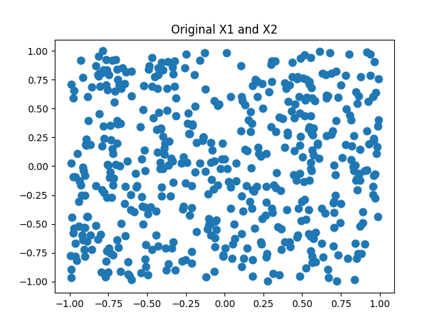
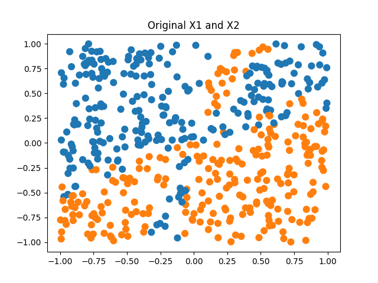
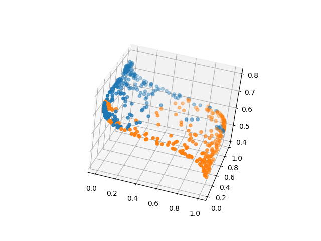
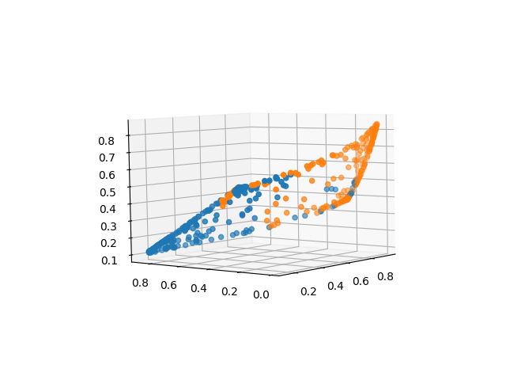
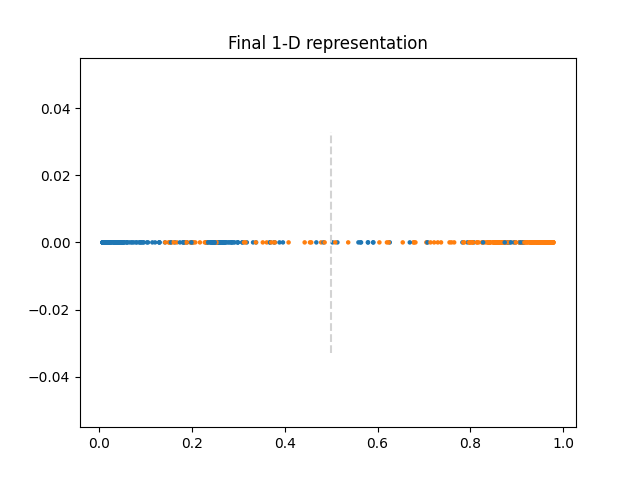
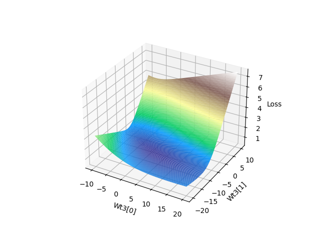
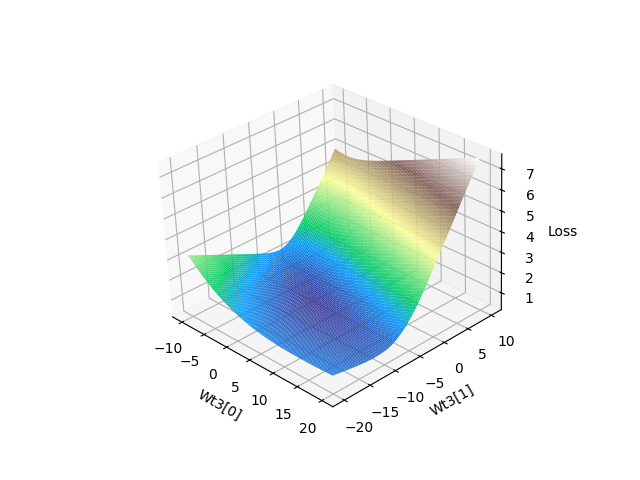
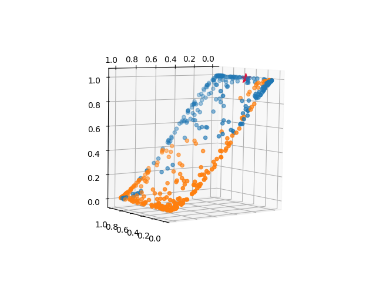
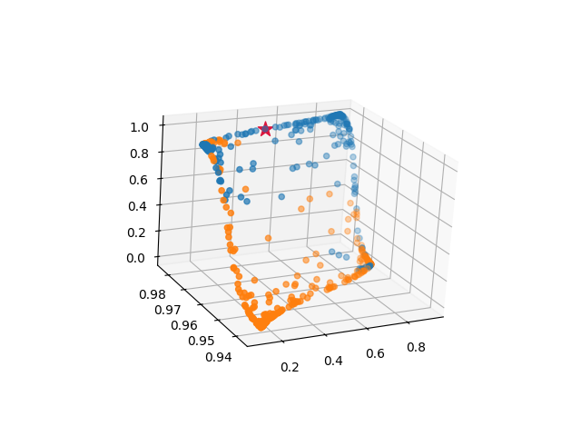
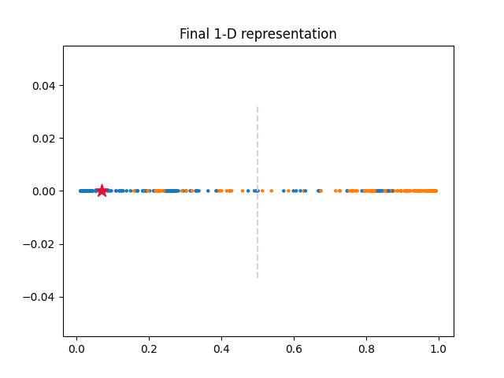

# Example of data projections in neural networks
## Purpose:  
Explore how neural nets use transformations/representations of data to perform binary classification tasks. 

## Methods:  
1. Generate a synthetic data set: a 2-dimensional set of features (X1 and X2) and a binary target variable (y).
2. Force a relationship between X's and y; otherwise, it will be difficult to make predictions using just two features.
3. Build network. I chose to create this from scratch using resources from simple online tutorials...

**Number of layers:** 2 hidden, 1 output  
**Layer structure:** 3 neurons **->** 3 neurons **->** 1 neuron  
**Network architecture:** 2 inputs **->** 3-dimensional representation **->** 3-dimensional representation **->** 1-dimensional probability (classification)  
**Loss:** Binary Cross-Entropy  
**Optimization method:** Full-batch gradient descent

-----------
# Figures!  

**Figure 1:** Scatter plots of X1 and X2 with a uniform distribution of observations. Classes are not perfectly linearly separable using X1 and X2.
| Scatter of features, unlabeled                                          | Scatter of features, labeled                                    |
|-------------------------------------------------------------------------|-----------------------------------------------------------------|
|  |  |

-----------

**Figure 2:** 3-D representation of the original inputs (X1 and X2) after the first network layer.
  

-----------

**Figure 3:** 3-D representation after the second network layer.
  

-----------

**Figure 4:** 1-D representation after the third network layer. A grey dashed line is included as an example class separation line at 0.50.  
  

-----------

## Big picture take-away:  
- Neural networks create higher-level representations of the original inputs
- These representations help identify patterns in data that may be difficult to find in the data's original form, particularly in high-dimensional data
- Transformation to new representations is the task of weights (i.e., weighted sums at each neuron) plus the choice of activation function (i.g., sigmoid)
- A "good" representation of the data (1) has weights that reflect a global minima in gradient descent, or at least a local minima that generalizes well, and (2) results in representations that improve overall prediction. 

------------

# Loss Landscape:  

**Figure 5:** Demonstrates the loss landscape for various values of two weights in the final layer.  
|                                            |                                            |
|--------------------------------------------|--------------------------------------------|
|  |  |

***Note:** This is the landscape for loss with respect to only two weights in the final layer of the model. The complete loss landscape is not depicted here. Both images are of the same landscape, just with a different orientation/viewpoint. 

------------

## Extra figures:  

**Red star plots:** Track how an individual observation (red star) is transformed from its' original input, X1 and X2, to projection onto new coordinate systems.  
|                                            |                                            |
|--------------------------------------------|--------------------------------------------|
|  |  |
|  |  |

***Note:** Plots are slightly different than those shown earlier in this repo. In building this component, I realized the weights and biases were initialized as random values, but without first setting the seed. Thus, reproducibility was not possible; different starting weights result in different ending weights (settling in a different local minima). The new code included in this repo uses a seed for weight and bias initialization.*

